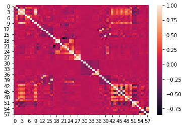
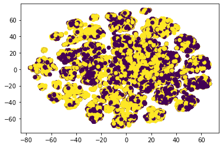

# Popularidad de Noticias Online

## Descripción del problema
Tenemos un problema de clasificación binaria con un dataset en el que nos proporcionan diferentes características sobre una determinada noticia para intentar predecir si la noticia será popular en internet o no. El dataset se compone de 39797 samples recopilados de la página de noticias Mashable, y tiene los atributos y los targets en el mismo archivo. El dataset nos proporciona en la última columna de los datos el número de shares (interacciones/veces compartido) de una noticia en esa página, y ese número es el que vamos a usar para decidir si un artículo es popular o no, pero no lo usaremos como un atributo sino que lo convertiremos en valores booleanos para usarlos como target de la clasificación binaria.

- **X**: Tenemos 60 atributos en el dataset, pero dos de ellos (url y días entre la publicación y la adquisición del dataset) no se usan para predecir y son meramente informativos para poner los datos en contexto y diferencias una noticia de otra, lo que nos deja con 58 atributos de predicción que son características de cada noticia. Hay cuatro tipos de atributos en función de su valor: números enteros, valores entre 0 y 1, booleanos y nominales, aunque los valores nominales son precisamente los que no se usan para predecir. Podemos agrupar los atributos en cuanto a si se basan en las palabras de la noticia, los links de la noticia, el contenido multimedia de la noticia, el día de salida de la noticia, sus etiquetas o a un Procesamiento del Lenguaje Natural de la noticia.

| Característica                                               | Basado en  | Tipo     |
|--------------------------------------------------------------|------------|----------|
| Nº de palabras en el título                                  | Palabras   | Entero   |
| Nº de palabras en el texto                                   | Palabras   | Entero   |
| Longitud media de las palabras                               | Palabras   | Entero   |
| Ratio de palabras no vacías                                  | Palabras   | Ratio    |
| Ratio de palabras únicas                                     | Palabras   | Ratio    |
| Ratio de palabras únicas no vacías                           | Palabras   | Ratio    |
| Nº de links                                                  | Links      | Entero   |
| Nº de links a noticias de Mashable                           | Links      | Entero   |
| Nº de shares de links de Mashable (min, max y media)         | Links      | Entero   |
| Nº de imágenes                                               | Multimedia | Entero   |
| Nº de vídeos                                                 | Multimedia | Entero   |
| Día de la semana                                             | Temporal   | Nominal^ |
| ¿Publicado en fin de semana?                                 | Temporal   | Booleano |
| Nº de etiquetas                                              | Etiquetas  | Entero   |
| Peor etiqueta (min, max y media de shares)                   | Etiquetas  | Entero   |
| Etiqueta media (min, max y media de shares)                  | Etiquetas  | Entero   |
| Mejor etiqueta (min, max y media de shares)                  | Etiquetas  | Entero   |
| Categoría de la noticia                                      | Etiquetas  | Nominal^ |
| Cercanía a top 5 grupos ALD^^                                | PLN        | Ratio    |
| Subjetividad del título                                      | PLN        | Ratio    |
| Subjetividad del texto                                       | PLN        | Ratio    |
| Diferencia absoluta entre 0.5 y ratio subjetividad del texto | PLN        | Ratio    |
| Polaridad del título                                         | PLN        | Ratio    |
| Ratio de palabras positivas y negativas                      | PLN        | Ratio    |
| Ratio de palabras positivas frente a las neutrales           | PLN        | Ratio    |
| Ratio de palabras negativas frente a las neutrales           | PLN        | Ratio    |
| Polaridad de las palabras positivas (min, max, media)        | PLN        | Ratio    |
| Polaridad de las palabras negativas (min, max, media)        | PLN        | Ratio    |
| Polaridad del texto                                          | PLN        | Ratio    |
| Diferencia absoluta entre 0.5 y ratio polaridad del texto    | PLN        | Ratio    |

**^**: Los valores nominales vienen ya convertidos a valores booleanos con one-hot encoding.

**^^**: Asignación Latente de Dirichlet

- **Y**: Las etiquetas a predecir son etiquetas binarias donde 0 es que la noticia no es popular y 1 que la noticia sí es popular, marcando este límite en 1400 interacciones. Hemos decidido usar este umbral ya que es el umbral marcado en el paper asociado al dataset. Si el número de shares es menor que 1400 clasificamos a la noticia con un 0 (no es popular), si iguala o supera ese umbral la clasificamos con un 1 (sí es popular) $Y={0,1}$

- **f**: nuestra función objetivo es aquella que dada un vector $x \in X$ nos da un valor un valor (booleano) $y, y \in Y, Y=\{0,1\}$

El problema por tanto se podría haber resuelto también usando regresión para predecir el número de shares de una noticia, y convirtiendo ese share en 0 o 1 según el umbral que hemos visto. Hemos preferido hacerlo a través de clasificación binaria ya que supone un planteamiento más sencillo y podemos gestionar mejor los datos predichos que estén muy cerca del umbral.

### Correlación de los datos
Para ver si las variables están relacionadas entre sí vamos a calcular la matriz de coeficientes de correlación de Pearson usando la función `corr()` de los dataframes de Pandas. Luego representamos esa matriz con la función heatmap() del módulo seaborn. Como vemos en la imagen (Figura 1) no hay una correlación excesiva entre las variables, ya que los coeficientes son cercanos a cero en la mayoría de los casos.

### Visualización de los datos
Para visualizar los datos usamos la función TSNE del módulo manifold de sklearn. Esta función nos permite reducir la dimensionalidad de nuestro conjunto de datos de altas dimensiones a una cantidad de dimensiones que sea representable gráficamente. Con el parámetro n_components indicamos el número de dimensiones al que queremos reducir nuestro conjunto. Como vemos tenemos una nube de puntos compacta y que no tiene valores extremos. Además vemos que los datos no son separables en principio.

## Separación de los datos
En este problema tenemos un único archivo por lo que tenemos juntos los datos de training y los de test. Para separarlos usamos la función train_test_split del módulo model_selection de sklearn. A esta función le pasamos el conjunto de datos y el de etiqutas junto al porcentaje que queremos que represente el test. Hemos elegido un 20% de datos para el conjunto de test ya que es una recomendación que se dio en clase de prácticas. La función divide en la proporción seleccionada el conjunto de datos cogiendo muestras aleatorias, y devuelve 4 conjuntos, los dos de training y los dos de test. Usamos el parámetro random_state=0 para que siempre se use la misma semilla aleatoria a la hora de dividir los datos y poder obtener asi resultados reproducibles.

## Preprocesado de los datos

No tenemos datos faltantes ni clases desbalanceadas. Además, las variables categóricas vienen ya codificadas con one-hot encoding.

### Estandarización
Calculamos la varianza y la media de nuestro conjunto de entrenamiento como la media de la media y la varianza de cada atributo. Obtenemos una varianza de 1210949639.72 y una media de 18237.71. Estos son valores muy altos por lo que la estandarización aquí se nos hace prácticamente obligatoria. Usamos la función StandardScaler() del módulo preprocessing de sklearn, que nos hace una estandarización de los datos, es decir, resta la media y divide por la desviación típica. Después de aplicar estandarizado la varianza es 1 y la media es 0 (aprox).

### Reducción de dimensionalidad
Aunque no haya una correlación alarmante entre las variables, hemos decidido aplicar un algoritmo de reducción de dimensionalidad para simplificar el conjunto de datos y agilizar así la tarea de aprendizaje. Como tenemos variables tanto numéricas como categóricas, vamos a separar primero las carácteristicas categóricas para aplicar PCA a las numéricas, y luego volveremos a unirlas. Hemos optado por esta opción por simpleza y porque ya conocemos PCA, antes que otras opciones como por ejemplo usar un método de reducción de dimensionalidad para datos mixtos como Factor analysis of mixed data (FAMD) o Multiple factor analysis (MFA), ya que desconocemos su funcionamiento y no están implementadas en sklearn, por lo que tendríamos que hacer la implementación propia.

Para aplicar PCA usamos la función PCA del módulo decomposition de sklearn, que reduce la dimensionalidad del conjunto de forma que las variables seleccionadas son ortogonales entre sí, intentando maximizar la varianza explicada. La vamos a usar con los hiperparámetros n_components=0.95 y svd_solver=full, ya que con estos parámetros lo que hace la función es reducir la dimensionalidad del conjunto todo lo que pueda pero asegurando siempre que la cantidad de varianza explicada es mayor al porcentaje indicado en n_components, en este caso 95%. Es decir que estamos manteniendo como mínimo un 95% de representatividad en los datos.

Una vez aplicamos PCA y volvemos a unir las variables categóricas, nos quedamos con un total de 41 características para un 95% de varianza explicada, dato que concuerda con la cantidad de correlación que habíamos visto que tenían las variables.

### Eliminación de outliers

Como no tenemos datos que se alejen excesivamente del conjunto de datos, no vemos necesario usar una técnica de eliminación de outliers.

## Métrica a usar
Para este problema vamos a usar la métrica AUC para medir lo bien que lo hace el modelo. Está métrica nos da un valor entre 0 y 1, y dicho valor será el área bajo la curva ROC, que es la curva que dibuja una gráfica según la tasa de positivos (eje y) y la tasa de falsos positivos (eje x). Este valor entre 0 y 1 nos va a señalar la probabilidad de que, dado un dato de muestra, el modelo lo clasifique bien. Siendo 1 el 100% de probabilidad, 0.5 el peor caso con 50% de probabilidad (aleatorio) y 0 sería que manda los positivos a los negativos y viceversa.  Hemos elegido esta métrica porque nos parece la mejor, ya que expresa el error en términos relativos al problema en lugar de valores absolutos, mide la calidad de las predicciones del modelo y es invariante respecto de la escala y el umbral de clasificación del modelo.

## Elección del mejor modelo
Para seleccionar el mejor modelo vamos a usar Cross-Validation, con la intención de evitar el sobreajuste de nuestro modelo al conjunto de datos de entrenamiento. Para hacer esto usamos la función cross-validate del módulo model_selection de sklearn. Los parámetros más importantes son el estimador (modelo) que queremos entrenar, el conjunto de datos y el de etiquetas, el número de folds que queremos realizar, n_jobs=-1 para usar todos los procesadores y scoring para usar nuestra métrica de evaluación del modelo. La función realiza una división en k folds (en nuestro caso 5) del conjunto de entrenamiento, realizando k iteraciones (por lo que tenemos 5 scores) donde k-1 particiones se usan para entrenar al modelo y la otra partición se usa para evaluar el modelo, esta última iteración cambia en cada iteración. La función nos devuelve los tiempos de entrenamiento y evaluación y el error de las k (5) evaluaciones.

Calculamos el error del modelo como la media de los 5 errores obtenidos de evaluar el modelo en cross-Validation. El que mejor puntuación alcance, el más cercano a 1 ya que estamos usando AUC, será el modelo que elegiremos para entrenar con todo el conjunto de entrenamiento y luego comprobar el test.

## Modelos a usar

Como modelo lineal vamos a usar Linear SVC, usando la función LinearSVC del módulo svm de sklearn. Los otros dos modelos que vamos a usar son Random Forest y ¿¿¿¿¿Redes Neuronales?????

Para la obtención de los mejores parámetros vamos a usar la función GridSearchCV, que encuentra los mejores parámetros para un estimador, dentro de unos valores dados, probando combinaciones de esos parámetros en Cross-Validation, y nos da el mejor estimador junto con el error obtenido y los parámetros de dicho estimador. Esta función forma parte del módulo model_selection de sklearn. Los parámetros de ésta función son: el modelo del que queremos probar los parámetros, un diccionario donde estén los valores propuestos y los atributos y la métrica de evaluación con la que queremos calcular el error del modelo.

## Modelo Lineal SVC
Este modelo es similar al SVC no lineal con parametros `kernel='linear'`, pero implementado en terminos de **liblinear** en lugar de **libsvm**, por lo que segun la pagina oficial de sklearn aporta mayor flexibilidad en la elección de penalizaciones y funciones de perdida, a parte de que escala mejor con muestras de gran tamaño.

Aplicando este modelo vamos a comprobar como de bueno es el modelo usando **Cross-Validation** y comparar los resultados de dicho modelo usando los parametros por defecto y con los parametros personalizados, para medir dicho modelo usaremos la metrica **AUC**:

 LinearSVC                                                                | AUC      |
|------------------------------------------------------------------------------------|
| Parametros por defecto                                                  | 0.69721  |
| Con los parametros personalizados: C=0.5, dual=False, random_state=0    | 0.69561  |

Haciendo pruebas cambiando los diferentes parametros no veiamos mejora alguna con respecto a los parametros por defecto, un ejemplo es la tabla de arriba, puesto que al cambiar los parametros empeoraba nuestro modelo.

(NOTA: la eleccion de los parametros personalizados hemos usado **GridSearchCV** que comprueba que parametros ajusta mejor el modelo)

## Biografia
- (LinearSVC) https://scikit-learn.org/stable/modules/generated/sklearn.svm.LinearSVC.html
- 
