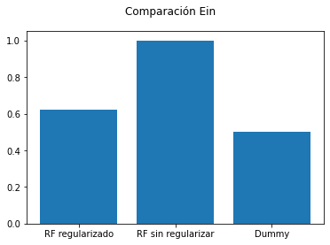
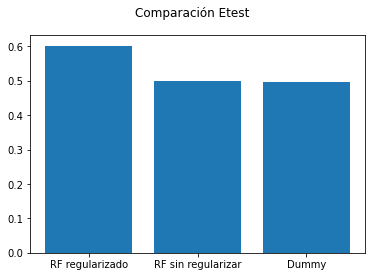

# Popularidad de Noticias Online
Alumnos: Eduardo Morales Muñoz y Rubén Girela Castell
## Descripción del problema
Tenemos un problema de clasificación binaria con un dataset en el que nos proporcionan diferentes características sobre una determinada noticia para intentar predecir si la noticia será popular en internet o no. El dataset se compone de 39797 samples recopilados de la página de noticias Mashable, y tiene los atributos y los targets en el mismo archivo. El dataset nos proporciona en la última columna de los datos el número de shares (interacciones/veces compartido) de una noticia en esa página, y ese número es el que vamos a usar para decidir si un artículo es popular o no, pero no lo usaremos como un atributo sino que lo convertiremos en valores booleanos para usarlos como target de la clasificación binaria.

- **X**: Tenemos 60 atributos en el dataset, pero dos de ellos (url y días entre la publicación y la adquisición del dataset) no se usan para predecir y son meramente informativos para poner los datos en contexto y diferencias una noticia de otra, lo que nos deja con 58 atributos de predicción que son características de cada noticia. Hay cuatro tipos de atributos en función de su valor: números enteros, valores entre 0 y 1, booleanos y nominales, aunque los valores nominales son precisamente los que no se usan para predecir. Podemos agrupar los atributos en cuanto a si se basan en las palabras de la noticia, los links de la noticia, el contenido multimedia de la noticia, el día de salida de la noticia, sus etiquetas o a un Procesamiento del Lenguaje Natural de la noticia.

| Característica                                               | Basado en  | Tipo     |
|--------------------------------------------------------------|------------|----------|
| Nº de palabras en el título                                  | Palabras   | Entero   |
| Nº de palabras en el texto                                   | Palabras   | Entero   |
| Longitud media de las palabras                               | Palabras   | Entero   |
| Ratio de palabras no vacías                                  | Palabras   | Ratio    |
| Ratio de palabras únicas                                     | Palabras   | Ratio    |
| Ratio de palabras únicas no vacías                           | Palabras   | Ratio    |
| Nº de links                                                  | Links      | Entero   |
| Nº de links a noticias de Mashable                           | Links      | Entero   |
| Nº de shares de links de Mashable (min, max y media)         | Links      | Entero   |
| Nº de imágenes                                               | Multimedia | Entero   |
| Nº de vídeos                                                 | Multimedia | Entero   |
| Día de la semana                                             | Temporal   | Nominal^ |
| ¿Publicado en fin de semana?                                 | Temporal   | Booleano |
| Nº de etiquetas                                              | Etiquetas  | Entero   |
| Peor etiqueta (min, max y media de shares)                   | Etiquetas  | Entero   |
| Etiqueta media (min, max y media de shares)                  | Etiquetas  | Entero   |
| Mejor etiqueta (min, max y media de shares)                  | Etiquetas  | Entero   |
| Categoría de la noticia                                      | Etiquetas  | Nominal^ |
| Cercanía a top 5 grupos ALD^^                                | PLN        | Ratio    |
| Subjetividad del título                                      | PLN        | Ratio    |
| Subjetividad del texto                                       | PLN        | Ratio    |
| Diferencia absoluta entre 0.5 y ratio subjetividad del texto | PLN        | Ratio    |
| Polaridad del título                                         | PLN        | Ratio    |
| Ratio de palabras positivas y negativas                      | PLN        | Ratio    |
| Ratio de palabras positivas frente a las neutrales           | PLN        | Ratio    |
| Ratio de palabras negativas frente a las neutrales           | PLN        | Ratio    |
| Polaridad de las palabras positivas (min, max, media)        | PLN        | Ratio    |
| Polaridad de las palabras negativas (min, max, media)        | PLN        | Ratio    |
| Polaridad del texto                                          | PLN        | Ratio    |
| Diferencia absoluta entre 0.5 y ratio polaridad del texto    | PLN        | Ratio    |

**^**: Los valores nominales vienen ya convertidos a valores booleanos con one-hot encoding.

**^^**: Asignación Latente de Dirichlet

- **Y**: Las etiquetas a predecir son etiquetas binarias donde 0 es que la noticia no es popular y 1 que la noticia sí es popular, marcando este límite en 1400 interacciones. Hemos decidido usar este umbral ya que es el umbral marcado en el paper asociado al dataset. Si el número de shares es menor que 1400 clasificamos a la noticia con un 0 (no es popular), si iguala o supera ese umbral la clasificamos con un 1 (sí es popular) $Y={0,1}$

- **f**: nuestra función objetivo es aquella que dada un vector $x \in X$ nos da un valor un valor (booleano) $y, y \in Y, Y=\{0,1\}$

El problema por tanto se podría haber resuelto también usando regresión para predecir el número de shares de una noticia, y convirtiendo ese share en 0 o 1 según el umbral que hemos visto. Hemos preferido hacerlo a través de clasificación binaria ya que supone un planteamiento más sencillo y podemos gestionar mejor los datos predichos que estén muy cerca del umbral. Además, es el enfoque utilizado en los papers que tratan este dataset.

### Correlación de los datos
Para ver si las variables están relacionadas entre sí vamos a calcular la matriz de coeficientes de correlación de Pearson usando la función `corr()` de los dataframes de Pandas. Luego representamos esa matriz con la función heatmap() del módulo seaborn. Como vemos en la imagen (Figura 1) no hay una correlación excesiva entre las variables, ya que los coeficientes son cercanos a cero en la mayoría de los casos.

### Visualización de los datos
Para visualizar los datos usamos la función TSNE del módulo manifold de sklearn. Esta función nos permite reducir la dimensionalidad de nuestro conjunto de datos de altas dimensiones a una cantidad de dimensiones que sea representable gráficamente. Con el parámetro n_components indicamos el número de dimensiones al que queremos reducir nuestro conjunto. Como vemos tenemos una nube de puntos compacta y que no tiene valores extremos. Además vemos que los datos de ambas clases están muy juntos, y en principio será difícil separarlos.

## Codificación de los datos

No tenemos datos faltantes (lo pone en la página del paper) ni clases desbalanceadas ya que tenemos 18490 muestras de la clase 0 y 21154 de la clase 1. Además, las variables categóricas vienen ya codificadas en el dataset con one-hot encoding. Por tanto no necesitamos hacer codificación de nuestros datos de entrada.

## Separación de los datos
En este problema tenemos un único archivo por lo que tenemos juntos los datos de training y los de test. Para separarlos usamos la función train_test_split del módulo model_selection de sklearn. A esta función le pasamos el conjunto de datos y el de etiqutas junto al porcentaje que queremos que represente el test. Hemos elegido un 20% de datos para el conjunto de test ya que es una recomendación que se dio en clase de prácticas. La función divide en la proporción seleccionada el conjunto de datos cogiendo muestras aleatorias, y devuelve 4 conjuntos, los dos de training y los dos de test. Usamos el parámetro random_state=0 para que siempre se use la misma semilla aleatoria a la hora de dividir los datos y poder obtener asi resultados reproducibles.

## Preprocesado de los datos

### Estandarización
Calculamos la varianza y la media de nuestro conjunto de entrenamiento como la media de la media y la varianza de cada atributo. Obtenemos una varianza de 1210949639.72 y una media de 18237.71. Estos son valores muy altos por lo que la estandarización aquí se nos hace prácticamente obligatoria. Usamos la función StandardScaler() del módulo preprocessing de sklearn, que nos hace una estandarización de los datos, es decir, resta la media y divide por la desviación típica. Después de aplicar estandarizado la varianza es 1 y la media es 0 (aprox). Usamos estandarización ya que es una técnica de normalización sencilla y efectiva.

### Reducción de dimensionalidad
Aunque no haya una correlación alarmante entre las variables, hemos decidido aplicar un algoritmo de reducción de dimensionalidad para simplificar el conjunto de datos y agilizar así la tarea de aprendizaje. Como tenemos variables tanto numéricas como categóricas, vamos a separar primero las carácteristicas categóricas para aplicar PCA a las numéricas, y luego volveremos a unirlas. Hemos optado por esta opción por simpleza y porque ya conocemos PCA, antes que otras opciones como por ejemplo usar un método de reducción de dimensionalidad para datos mixtos como Factor analysis of mixed data (FAMD) o Multiple factor analysis (MFA), ya que desconocemos su funcionamiento y no están implementadas en sklearn, por lo que tendríamos que hacer la implementación propia.

Para aplicar PCA usamos la función PCA del módulo decomposition de sklearn, que reduce la dimensionalidad del conjunto de forma que las variables seleccionadas son ortogonales entre sí, intentando maximizar la varianza explicada. La vamos a usar con los hiperparámetros n_components=0.95 y svd_solver=full, ya que con estos parámetros lo que hace la función es reducir la dimensionalidad del conjunto todo lo que pueda pero asegurando siempre que la cantidad de varianza explicada es mayor al porcentaje indicado en n_components, en este caso 95%. Es decir que estamos manteniendo como mínimo un 95% de representatividad en los datos.

Una vez aplicamos PCA y volvemos a unir las variables categóricas, nos quedamos con un total de 41 características para un 95% de varianza explicada, dato que concuerda con la cantidad de correlación que habíamos visto que tenían las variables.

### Eliminación de outliers

Como no tenemos datos que se alejen excesivamente del conjunto de datos, no vemos necesario usar una técnica de eliminación de outliers.

## Métrica de avaluación a usar
Para este problema vamos a usar la métrica AUC para medir lo bien que lo hace el modelo. Está métrica nos da un valor entre 0 y 1, y dicho valor será el área bajo la curva ROC, que es la curva que dibuja una gráfica según la tasa de positivos (eje y) y la tasa de falsos positivos (eje x). Este valor entre 0 y 1 nos va a señalar la probabilidad de que, dado un dato de muestra, el modelo lo clasifique bien. Siendo 1 el 100% de probabilidad, 0.5 el peor caso con 50% de probabilidad (aleatorio) y 0 sería que manda los positivos a los negativos y viceversa.  Hemos elegido esta métrica porque nos parece la mejor, ya que expresa el error en términos relativos al problema en lugar de valores absolutos, mide la calidad de las predicciones del modelo y es invariante respecto de la escala y el umbral de clasificación del modelo.

Aunque AUC va a ser nuestra métrica de referencia, también vamos a usar Accuracy. Accuracy nos dice el porcentaje de veces que nuestro modelo acierta al clasificar. En nuestro caso es una medida representativa ya que las clases se encuentran balanceadas, y si no estuvieran balanceadas no podríamos usarla. Aún así, esta métrica será solo un complemento, y la métrica discriminatoria que usaremos para elegir el modelo será AUC. Al igual que AUC, en Accuracy un 1.0 representa una clasificación perfecta mientras que un 0.5 representa un clasificador aleatorio.  

## Elección del mejor modelo
Para seleccionar el mejor modelo vamos a usar Cross-Validation, con la intención de evitar el sobreajuste de nuestro modelo al conjunto de datos de entrenamiento. Para hacer esto usamos la función cross-validate del módulo model_selection de sklearn. Los parámetros más importantes son el estimador (modelo) que queremos entrenar, el conjunto de datos y el de etiquetas, el número de folds que queremos realizar, n_jobs=-1 para usar todos los procesadores y scoring para usar nuestra métrica de evaluación del modelo. La función realiza una división en k folds (en nuestro caso 5) del conjunto de entrenamiento, realizando k iteraciones (por lo que tenemos 5 scores) donde k-1 particiones se usan para entrenar al modelo y la otra partición se usa para evaluar el modelo, esta última iteración cambia en cada iteración. La función nos devuelve los tiempos de entrenamiento y evaluación y el error de las k (5) evaluaciones.

Calculamos el error del modelo como la media de los 5 errores obtenidos de evaluar el modelo en cross-Validation. El que mejor puntuación alcance, el más cercano a 1 ya que estamos usando AUC, será el modelo que elegiremos para entrenar con todo el conjunto de entrenamiento y luego comprobar el test.

## Elección de hiperparámetros

Para la obtención de los mejores parámetros vamos a usar la función GridSearchCV, que encuentra los mejores parámetros para un estimador, dentro de unos valores dados, probando combinaciones de esos parámetros en Cross-Validation (para disminuir el sobreajuste), y nos da el mejor estimador junto con el mejor error obtenido y los parámetros de dicho estimador. Esta función forma parte del módulo model_selection de sklearn. Los parámetros de ésta función son: el modelo del que queremos probar los parámetros, un diccionario donde estén los valores propuestos y los atributos, y la métrica de evaluación con la que queremos calcular el error del modelo. Esta función la hemos usado para estimar los parámetros que no eran de regularización.

## Modelos seleccionados
Para abordar el problema hemos seleccionado como modelo lineal una **SVM** de clasificación con kernel lineal y como modelos no lineales **Random Forest** y **Perceptrón Multicapa** de 3 capas.

Para resolver el problema usaremos la clase de las funciones lineales en el caso de la SVM lineal. En el caso de Perceptrón multicapa y RandomForest, debido a las características de los algoritmos de aprendizaje, desconocemos las funciones que usarán, pero previsiblemente no serán lineales.

Hemos elegido SVM ya que nos parece la solución linear que más nos puede aportar. SVC busca linealidad en dimensiones superiores a la de partida, por lo que puede encontrar una separación lineal en conjuntos de datos donde el Perceptrón o la Regresión Lineal no lo harían.

En el Perceptrón Multicapa tenemos que es un modelo muy potente capaz de aproximar funciones objetivo muy complejas como la que previsiblemente tenemos en nuestro problema. De hecho si f se puede descomponer en perceptrones usando funciones OR y AND entonces se puede implementar con nuestro perceptron de 3 capas, y aunque no lo sea, si el límite de decisión es suave entonces se puede aproximar tanto como se quiera a f.

Random Forest es un predictor muy eficiente basado en bagging, por lo que cuenta con las ventajas del bagging. Cada árbol tiene alta varianza y bajo sesgo, y al hacer el promedio de los árboles reduciremos la varianza, por lo que tenemos un predictor con bajo sesgo y baja varianza. Además construye árboles no correlados cogiendo m predictores para una partición en lugar de usarlos todos, lo que reduce aún más la varianza. Aún así, tenemos que tener cuidado con el sobreajuste, ya que si no ajustamos bien los parámetros podemos acabar con casi cero error en la muestra pero mucho error en el test.

## Regularización usada
Hemos visto necesario usar una alta regularización en los modelos, ya que los modelos no lineales que usamos son muy propensos a sobreajustarse a los datos. Además, el conjunto de datos que tenemos no es facilmente separable y requerirá de una función compleja, por lo que un buen rendimiento del modelo en el entrenamiento se puede confundir facilmente con un sobreajuste del modelo a los datos. Además, fijandonos en los valores de predicción obtenidos en varios modelos de los papers que tratan este dataset, hemos visto que los resultados de nuestros modelos con poca o ninguna regularización eran, como poco, muy optimistas, por lo que podíamos intuir un sobreajuste a los datos de entrenamiento. De esta manera, hemos decidido sacrificar un poco de error Ein para que nuestras hipótesis no sufran de sobreajuste. De esta manera hemos calculado el error de nuestros modelos sin regularización (o regularización por defecto) para luego ir aumentando la fuerza de la regularización poco a poco hasta obtener un modelo menos sobreajustado, sacrificando aproximadamente 5 puntos en la métrica de clasificación de cada modelo. Antes de aplicar la regularización, hemos calculado los mejores parámetros para cada algoritmo de aprendizaje.

Usamos la regularización L2 (Ridge) en SVC y Perceptrón multicapa ya que es la que mejor se adapta a nuestro problema. Si usaramos regularización L1 entonces los pesos de algunas de nuestras variables serían cero, cosa que no nos interesa en absoluto ya que hemos aplicado previamente PCA por lo que ya tenemos variables reducidas. En el Perceptrón multicapa, el parámetro de regularización es alpha, y cuanto mayor es este valor, mayor será la regularización del modelo. En LinearSVC el parámetro de regularización es C, que es inversamente proporcional a la fuerza de la regularización.

Para Random Forest, la regularización no se basa en L1 o L2, sino que tenemos cuatro parámetros que van a controlar esto: máxima profundidad del árbol, número mínimo de muestras necesarias para dividir un nodo, número mínimo de muestras que debe haber en un nodo hoja y número máximo de nodos finales. Estos parámetros toman valores numéricos, y conforme vamos aumentando los valores de los parámetros minimos y vamos disminuyendo los de los parámetros máximos, irá aumentando la regularización de nuestro modelo.

## Modelo Lineal SVC
Este modelo es similar a SVC con parametros `kernel='linear'`, pero implementado en terminos de **liblinear** en lugar de **libsvm**, por lo que segun la pagina oficial de sklearn aporta mayor flexibilidad en la elección de penalizaciones y funciones de perdida, a parte de que escala mejor con muestras de gran tamaño. Para usarlo hemos hecho uso de la libreria sklearn.svm y en ella usamos la funcion LinearSVC().

Tras aplicar GridSearchCV hemos obtenido el valor **squared hinge** para el parámetro **loss**. Hemos usado valores predefinidos para los parámetros penalty y Dual. Hemos seleccionado penalty=l2 porque es el tipo de regularización que nos interesa para nuestro problema. El parámetro Dual selecciona si queremos resolver el problema principal o el problema dual, y en la página de ayuda de sklearn se recomienda ponerlo en False para datasets donde la cantidad de las muestras sea mayor que la cantidad de características.

| LinearSVC                                                | AUC      |
|----------------------------------------------------------|----------|
| Sin regularización                                       | 0.692    |
| Regularización                                           | 0.639    |

## Perceptrón Multicapa

Para implementar el Perceptrón multicapa hemos usado la función MLPClassifier del módulo neural_network de sklearn. Para usar la arquitectura de 3 capas debemos pasarle un array de longitud 2 con la cantidad de unidades por capa de cada capa. Así tendremos 2 capas ocultas más la capa de salida que conformarán la arquitectura de 3 capas.

Para el cálculo de los parámetros hemos hecho uso de GridSearchCV, pero debido a la ingente cantidad de valores posibles y la potencia computacional que requeriría hacer todas las comprobaciones a la vez, hemos decidido ajustar primero el número de neuronas por capa y luego los demas parámetros. Para el número de neuronas por capa hemos usado pares (i,j) donde i,j son múltiplos de 10 entre 50 y 100. Hemos obtenido así que la mejor combinación de neuronas por capa en (50,50). Luego para afinar más hemos tomado pares cercanos a este, obteniendo que la mejor combinación es (52,55) neuronas.

Con este parámetro fijado, hemos vuelto a usar GridSearchCV para la obtención del resto de hiperparámetros, obteniendo los siguientes:

| Parámetro          | Valor    |
|--------------------|----------|
| Activation         | logistic |
| Solver             | sgd      |
| learning_rate      | constant |
| learning_rate_init | 0.01     |

El parámetro de activación es la función que tendrán las capas ocultas en cada unidad, en este caso la función sigmoide. El learning rate inicial será de 0.01. El parámetro learning_rate='constant' hace referencia a como va variando el learning rate a lo largo del aprendizaje, en este caso será constante a lo largo de todo el aprendizaje. Este parámetro solo se usa cuando el algoritmo solver empleado es SGD, que es nuestro caso. Para el parámetro **alpha**, el de regularización, hemos decidido dejarlo en 2.5, que no es un valor muy alto, pero la subida de éste parámetro penalizaba demasiado la puntuación del modelo.

Aquí una tabla que resume un poco lo dicho anteriormente y muestra los scores en cada caso.

| Tamaño de Capas                           | Parámetros                   | AUC Score |
|-------------------------------------------|------------------------------|-----------|
| [50, 50]                                  | Por defecto                  | 0.659     |
| [52, 55]                                  | Por defecto                  | 0.661     |
| [52, 55]                                  | Optimizados                  | 0.704     |
| [52, 55]                                  | Optimizados + Regularización | 0.641     |
| [100, 100] (por defecto)                  | Por defecto                  | 0.658     |

## Random Forest
Para aplicarlo hemos usado la libreria ensemble de sklearn y en ella usamos la funcion RandomForestClassifier.

Hemos obtenido los parámetros del algoritmo de aprendizaje con la función GridSearchCV tal como se indica más arriba, obteniendo los siguientes resultados:

| Parámetro    | Valor   |
|--------------|---------|
| n_estimators | 500     |
| criterion    | entropy |
| n_jobs       | -1      |
| bootstrap    | True    |
| oob_score    | True    |
| random_state | 0       |

n_estimators es el número de árboles que vamos a generar, y criterion es la función que mide la calidad de la división. La opción entropy prioriza la ganancia de información, mientras que la otra (Gini) se basa en la impureza. Usamos n_jobs=-1 para que se usen todos los cores disponibles del procesador y así agilizar el aprendizaje. Con random_state=0 nos aseguramos de que se puedan reproducir los resultados. Con bootstrap=true usamos una parte de los datos de entrenamiento en lugar de usarlos enteros, y con oob_score=True (solo si bootstrap=True) usamos las muestras que no hemos escogido para estimar una generalización.

El parámetro de regularización que hemos escogido, siguiendo lo indicado anteriormente, ha sido max_leaf_nodes=4, que limita a 4 el número de nodos hoja que podrá tener un árbol.

| Regularización | Parámetros  | AUC Score |
|----------------|-------------|-----------|
| No             | Por defecto | 0.687     |
| No             | Optimizados | 0.708     |
| Si             | Optimizados | 0.66      |

## Mejor hipótesis

| Modelo              | Resultados |
|---------------------|------------|
| Linear SVC          | 0.639      |  
| Perceptron 3 capas  | 0.704      |
| Random Forest       | 0.7076     |

Comparando los resultados usando **Cross Validation** de los diferentes modelos, como se ha explicado antes, se puede ver en la tabla el mejor modelo es **Random Forest**, ya que da el mejor resultado de entre las tres hipótesis.

Por otro lado es uno de los metodos más populares en el Machine Learning, ya que se aproxima más a cumplir con los requisitos del objetivo.
Con lo cual por esas razones elegimos el algoritmo **Random Forest** para este problema.

## Evaluación del modelo
Ya hemos seleccionado Random Foresto como nuestro mejor modelo, ahora tenemos que calcular el error Eout entrenando nuestro modelo sobre todo el conjunto de entrenamiento y evaluándolo sobre la partición de test que hicimos al principio.

Para poder evaluar el modelo necesitamos realizar a los datos de test las mismas transformaciones que le hicimos a los datos de entrenamiento. Para ello usamos las funciones que teníamos para el preprocesado de los datos y transformamos X_test con esas funciones sin ajustarlas antes a ese conjunto, de manera que ya estaban ajustadas anteriormente a los datos de entrenamiento. En el caso de PCA debemos hacer lo mismo que con los datos de entrenamiento, ya que debemos guardar las variables categóricas para añadirlas una vez hecha la reducción de dimensionalidad.

Una vez preparados los datos de test, entrenamos el modelo con los datos de entrenamiento y evaluamos para obtener Ein, y luego evaluamos en el conjunto de test para obtener Eout.

| Random Forest  | Ein   | Eout  |
|----------------|-------|-------|
| AUC Score      | 0.62  | 0.602 |
| Accuracy Score | 0.619 | 0.599 |

Como se ve en la tabla anterior hemos conseguido un modelo que, aunque no tiene un score muy alto, clasifica bien los datos sobre el 60% de las veces y además tiene muy poco sobreajuste, por tanto es un modelo que generaliza bien los nuevos datos.

Para ponerlo un poco en contexto, vamos a evaluar los datos de entrenamiento y de test con un clasificador aleatorio (DummyClassifier de sklearn) para hacer la comparativa.

| Dummy Classifier | Ein   | Eout  |
|------------------|-------|-------|
| AUC Score        | 0.503 | 0.511 |
| Accuracy Score   | 0.503 | 0.499 |

Vemos que nuestro modelo está unos 10 puntos por encima de un clasificador aleatorio, que aunque no es un resultado perfecto, nos da un umbral del 60% de discriminación.

Vamos a ver ahora, a modo de curiosidad, que hubiera pasado si no hubieramos introducido regularización en nuestros modelos.

| RF (Sin regularización) | Ein | Eout  |
|-------------------------|-----|-------|
| AUC Score               | 1.0 | 0.499 |
| Accuracy Score          | 1.0 | 0.488 |

{width=40%}

Como vemos hay un sobreajuste enorme para el modelo sin regularización, teniendo una puntuación perfecta en los datos de entrenamiento pero un rendimiento pésimo en los datos de test, llegando a obtener peor clasificación que el clasificador aleatorio.

Con todos estos datos, podemos afirmar que hemos entrenado un buen modelo y que generaliza bien, sin apenas sobreajuste. El resultado no es perfecto, y podría ser mejorable, pero el umbral de mejora tampoco es tan alto ya que en los diferentes papers que tratan este dataset, el máximo umbral de clasificación (AUC o Accuracy) es del 70%, donde se usan métodos más avanzados y se requiere de más potencia computacional de la que nosotros disponemos.

{width=40%}

## Bibliografia
- [LinearSVC](https://scikit-learn.org/stable/modules/generated/sklearn.svm.LinearSVC.html)
- [Random Forest](https://www.iartificial.net/random-forest-bosque-aleatorio/#Random_Forest_en_scikit-learn_hiper-parametros_mas_utiles)
- [Random Forest](https://en.wikipedia.org/wiki/Random_forest)
- [RF](https://scikit-learn.org/stable/modules/generated/sklearn.ensemble.RandomForestClassifier.html)
- [AUC](https://scikit-learn.org/stable/modules/generated/sklearn.metrics.roc_auc_score.html#sklearn.metrics.roc_auc_score)
- [Accuracy](https://scikit-learn.org/stable/modules/generated/sklearn.metrics.accuracy_score.html#sklearn.metrics.accuracy_score)
- [Regularizacion en SVC](https://scikit-learn.org/stable/auto_examples/svm/plot_svm_scale_c.html)
- [MLP](https://scikit-learn.org/stable/modules/generated/sklearn.neural_network.MLPClassifier.html)
- [Cross Validation](https://scikit-learn.org/stable/modules/generated/sklearn.model_selection.cross_validate.html)
- [GridSearch](https://scikit-learn.org/stable/modules/generated/sklearn.model_selection.GridSearchCV.html)
- [Linear SVC](https://scikit-learn.org/stable/modules/generated/sklearn.svm.LinearSVC.html)
- [Paper](http://cs229.stanford.edu/proj2015/328_report.pdf)
- [Paper](https://repositorium.sdum.uminho.pt/bitstream/1822/39169/1/main.pdf)
